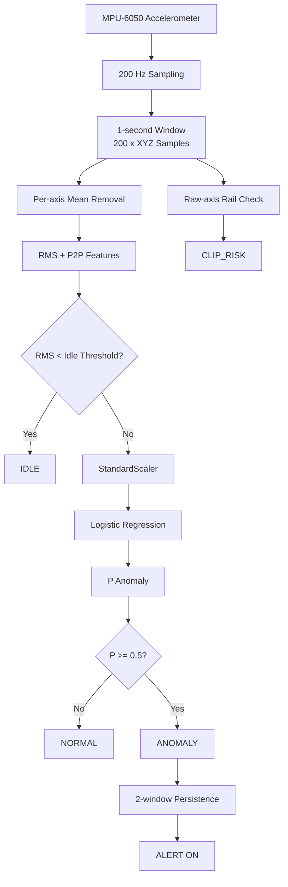

# Machine Sentinel

A lightweight edge vibration anomaly detector built with an **Arduino-compatible R4 board** and **MPU-6050**.

The system samples 3-axis acceleration at **200 Hz**, extracts simple vibration features, runs a tiny **Logistic Regression** model directly on the microcontroller, and reports:

- `IDLE`
- `NORMAL`
- `ANOMALY`
- persistent `ALERT`
- sensor saturation / `CLIP_RISK`

## Architecture



## Why this project

The goal was to build a small but complete **edge-ML monitoring pipeline**, not just stream sensor values.

The project covers:

- fixed-rate sensor acquisition
- vibration signal processing
- feature engineering
- controlled dataset collection
- train/test splitting by recording
- model ablation
- Python-to-C++ model deployment
- live embedded inference
- temporal alert persistence
- clipping detection

## Hardware

- Arduino R4-compatible board
- MPU-6050 accelerometer / gyroscope
- I2C connection
- speaker used as a controlled vibration source during experiments

Accelerometer configuration:

```text
Range:       ±8 g
Sensitivity: 4096 counts/g
Sample rate: 200 Hz
Window:      1 second
```

## Edge Features

The deployed model uses only:

```text
RMS
P2P
```

RMS measures overall dynamic vibration strength.

P2P measures the excursion between the minimum and maximum 3D dynamic acceleration magnitude within a window.

Frequency-domain features were also explored offline using FFT, including 40 Hz, 60 Hz and aliasing experiments. Ablation showed that the current controlled dataset was already perfectly separable using time-domain features, so FFT was not required for the final embedded classifier.

## Model

A `StandardScaler + LogisticRegression` pipeline was trained in Python.

Deployment does **not** require scikit-learn on the Arduino. The learned scaler values, model weights and intercept are exported as constants.

Runtime inference is:

```text
scaled_rms = (rms - mean_rms) / scale_rms
scaled_ptp = (ptp - mean_ptp) / scale_ptp

score =
    weight_rms * scaled_rms +
    weight_ptp * scaled_ptp +
    intercept

P(anomaly) = sigmoid(score)
```

## Robustness Logic

A low-RMS activity gate separates machine-off behavior from active operation:

```text
RMS < 0.0464 g -> IDLE
```

An alert is raised only after **2 consecutive anomalous windows**.

The alert is cleared after **2 consecutive non-anomalous windows**.

Raw accelerometer values are also monitored near the sensor rails to flag windows where the MPU may be saturating.

## Results

Held-out controlled recordings:

```text
RMS only          100%
RMS + P2P         100%
Frequency only    100%
All features      100%
```

Live embedded testing successfully demonstrated:

```text
IDLE     ✓
NORMAL   ✓
ANOMALY  ✓
ALERT    ✓
CLIP_RISK detection ✓
```

Example live output:

```text
RMS: 0.114532 g | P2P: 0.165146 g |
P(anomaly): 0.1975 | RAW: NORMAL |
CLIP_RISK: NO | ALERT: OFF
```

## Important Limitation

This is a **controlled prototype**, not a production predictive-maintenance system.

The speaker used for testing has a strong frequency-dependent mechanical response, so 40 Hz and 60 Hz conditions could not be cleanly amplitude-matched. Because of this, the final edge model primarily detects changes in vibration intensity / transient behavior rather than subtle frequency-only faults.

A stronger follow-up would use:

- a calibrated vibration source
- real machine data
- amplitude-matched frequency experiments
- frequency-domain features when they provide measurable added value


## Takeaway

Machine Sentinel demonstrates an end-to-end path from:

```text
sensor
→ signal processing
→ feature engineering
→ ML training
→ model interpretation
→ embedded inference
→ robust runtime behavior
```

The focus is not on claiming industrial fault diagnosis, but on building and validating a small, explainable edge-ML system from first principles.
