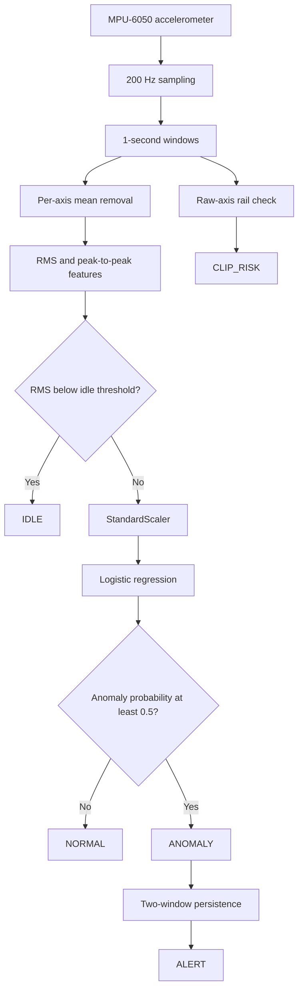

# Machine Sentinel

Machine Sentinel is a lightweight edge vibration anomaly detector built with an
Arduino-compatible R4 board and an MPU-6050. It samples 3-axis acceleration at
200 Hz, extracts vibration features, and runs a small logistic-regression model
on the microcontroller.

The runtime reports `IDLE`, `NORMAL`, `ANOMALY`, persistent `ALERT`, and sensor
`CLIP_RISK` states.

## Repository layout

Each stage now has one responsibility:

```text
analysis/                 dataset preparation and descriptive statistics
training/                 model fitting, evaluation, and export
visualization/            plot generation only
notebooks/analysis/       commented exploratory analysis notebooks
notebooks/training/       commented step-by-step training notebook
src/machine_sentinel/     reusable feature, dataset, and model code
firmware/                 embedded inference implementation
tests/                    unit tests for shared Python code
data/                     local raw/processed recordings (not committed)
models/                   generated model artifacts (not committed)
artifacts/figures/        generated plots (not committed)
```

The exploratory notebooks are retained under `notebooks/` for interactive work
and historical context. Their stale execution output has been cleared, and each
one starts with guidance about its scope. The reusable Python modules remain the
authoritative implementation so notebook experiments do not duplicate
production logic.

## Setup

Create an environment and install the project from the repository root:

```bash
python -m venv .venv
source .venv/bin/activate
python -m pip install -e .
```

Raw recordings are expected under `data/raw/final/`:

```text
data/raw/final/
├── normal_40/
├── loud_40/
├── freq_60/
├── stationary/
└── tapping/
```

## Workflow

Run the stages independently from the repository root.

1. Extract features from raw recordings:

   ```bash
   python -m analysis.extract_features
   ```

   This creates `data/processed/features.csv` and
   `data/processed/challenge.csv`.

2. Inspect numeric summaries without generating plots:

   ```bash
   python -m analysis.analyze_features
   ```

3. Generate visualizations:

   ```bash
   python -m visualization.plot_features
   ```

   PNG files are written to `artifacts/figures/`.

4. Train and export the model:

   ```bash
   python -m training.train_model
   ```

   The command compares RMS-only, time-domain, frequency-domain, and combined
   feature sets. It then exports the two-feature edge model to `models/` as a
   pickle, deployment constants in JSON, and evaluation metrics in JSON.

Run the unit tests with:

```bash
PYTHONPATH=src python -m unittest discover -s tests
```

To explore the original experiments interactively, start Jupyter and open a
notebook under `notebooks/analysis/` or `notebooks/training/`. Their relative
data paths assume the notebook kernel starts in the notebook's own directory.

## Signal pipeline



The deployed model uses only RMS and peak-to-peak amplitude. Frequency-domain
features remain in the offline analysis so their value can be measured before
adding embedded complexity.

## Current prototype results

Held-out controlled recordings produced 100% accuracy for RMS-only,
time-domain, frequency-domain, and combined feature experiments. Live embedded
testing demonstrated all runtime states, including clipping detection.

The learned edge-model constants currently embedded in the firmware are:

```text
Scaler mean:    [0.2503907709, 0.3384182347]
Scaler scale:   [0.1136292923, 0.1760807222]
Weights:        [2.3543119820, 2.1076915519]
Intercept:       3.4872158012
Idle threshold:  0.04637709 g
```

## Limitations

This is a controlled prototype, not a production predictive-maintenance
system. The speaker used during testing has a frequency-dependent mechanical
response, so the 40 Hz and 60 Hz conditions could not be cleanly
amplitude-matched. The current edge model therefore detects vibration intensity
and transient changes more reliably than subtle frequency-only faults.

A stronger follow-up would use a calibrated vibration source, real machine
recordings, amplitude-matched frequency experiments, and frequency-domain
features only when they show measurable added value.
